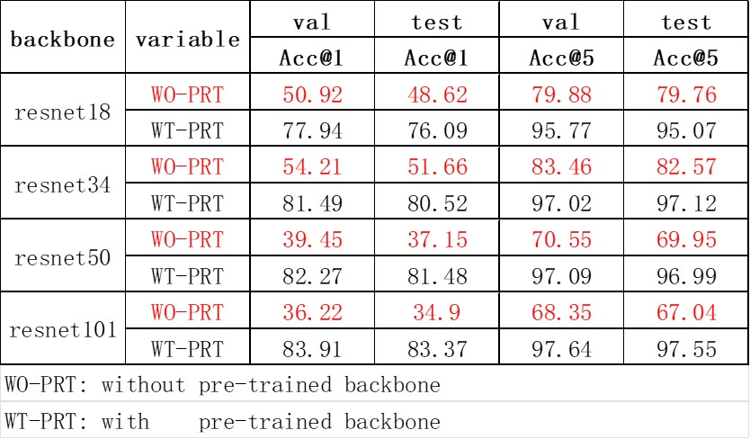
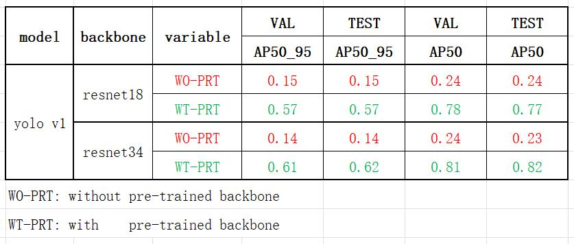
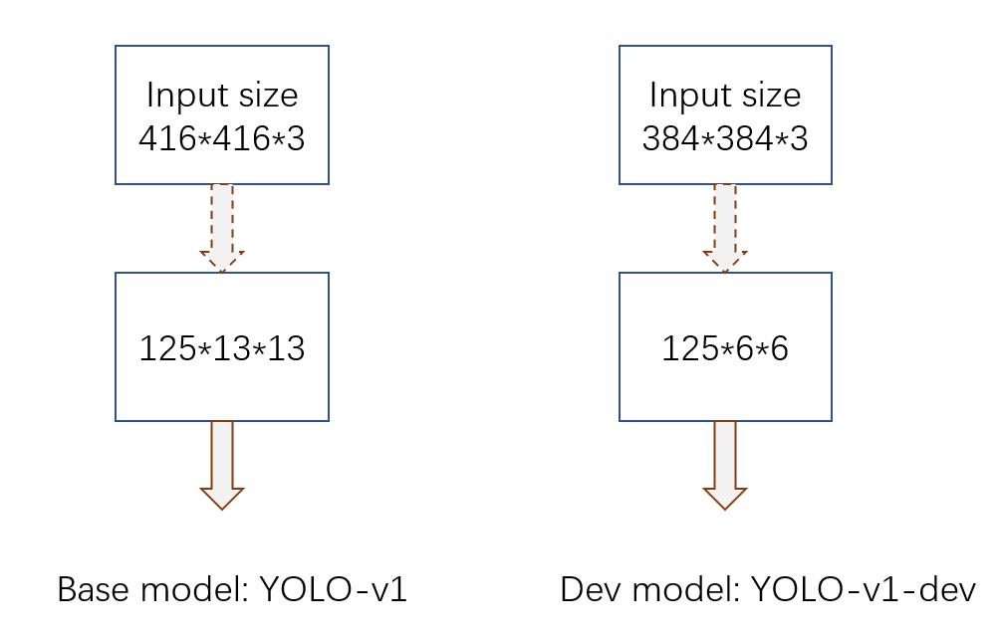
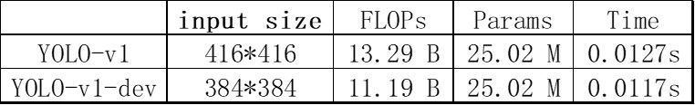
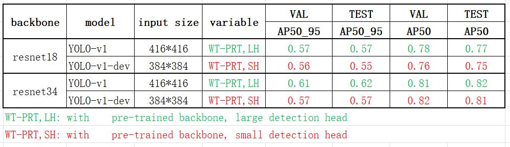
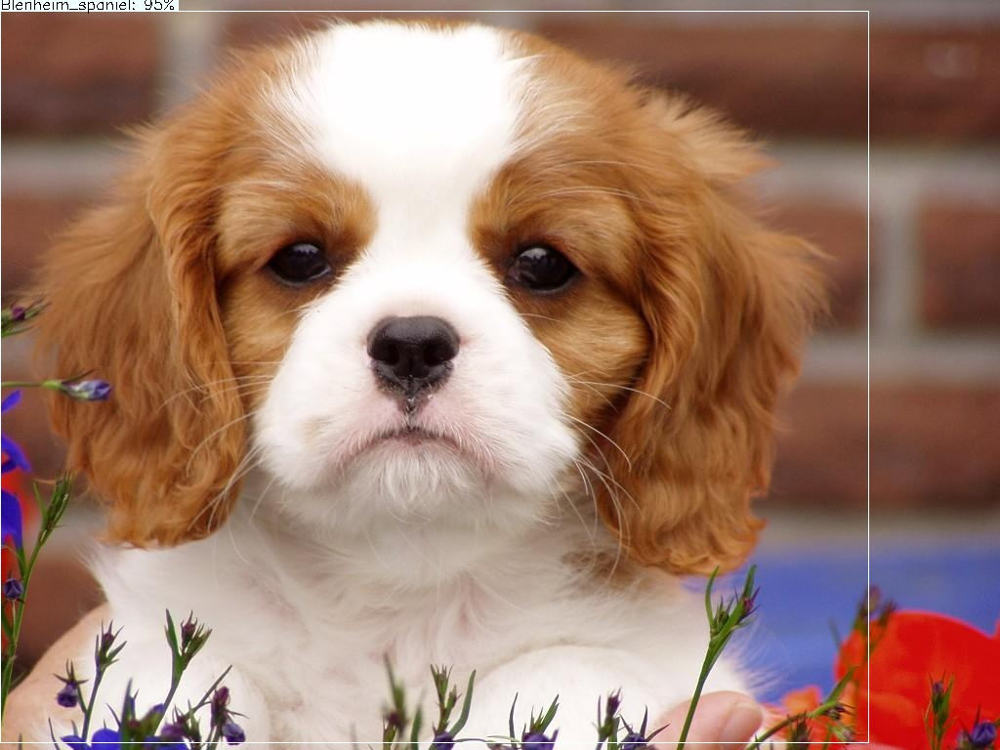
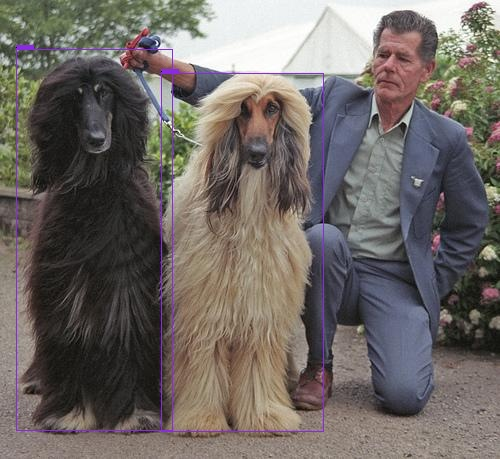
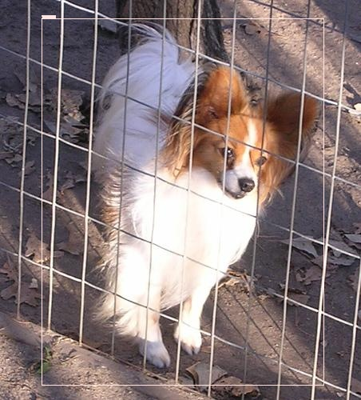
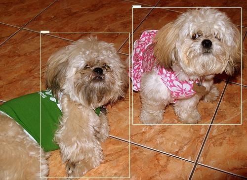

# YOLOv1_on_StanfordDog
This repo is forked and edited based on https://github.com/yjh0410/PyTorch_YOLOv1.git

## New features

- add classification model training 
```train_classification_net.py```

- add Stanford Dog dataloader and evaluator
```data/stanford_dog.py```
```evaluator/StanfordDogapi_evaluator.py```

- add dataset sorting code
```data/dataset_prepare.py```

- add new evaluation and inference code
```eval.py```

- add a new detection head
```configure stride and input_size in train.py```


## Dataset Download
Dataset can be downloaded from kaggle or official website.
- https://www.kaggle.com/datasets/jessicali9530/stanford-dogs-dataset

- http://vision.stanford.edu/aditya86/ImageNetDogs/main.html


## Dataset Preparation
Use ```data/dataset_prepare.py``` to sort the dataset to the following folder structure, split the dataset into 'Train'(70%), 'val'(15%), and 'test'(15%).
```
  train/
  |── Images
  |      ├── n02085620-Chihuahua
  |      │   ├── n01440764_10026.jpg
  |      │   ├── ......
  |      ├── ......
  |── Annotation
  |      ├── n02085620-Chihuahua
  |      │   ├── n01440764_10026
  |      │   ├── ......
  |      ├── ......
  |── anno_json
  |      ├── train.json
  val/
  |── Images
  |      ├── n02085620-Chihuahua
  |      │   ├── n01440764_10020.jpg
  |      │   ├── ......
  |      ├── ......
  |── Annotation
  |      ├── n02085620-Chihuahua
  |      │   ├── n01440764_10020
  |      │   ├── ......
  |      ├── ......
  |── anno_json
  |      ├── val.json
  test/
  |── Images
  |      ├── n02085620-Chihuahua
  |      │   ├── n01440764_10016.jpg
  |      │   ├── ......
  |      ├── ......
  |── Annotation
  |      ├── n02085620-Chihuahua
  |      │   ├── n01440764_10016
  |      │   ├── ......
  |      ├── ......
  |── anno_json
  |      ├── test.json
```

In order to match the ImageNet folder structure for classification model training,  images are saved under every category folder. To satisfy detection models training with COCO API and data-loader, when making annotation files, the value for “file_name” key in the json dict is written as following:

```
…
"file_name" : category/img_name, 
…
```

After sorting the dataset as above, it can be used for classification model training as well as detection model training.


## Classification net training and evaluation
```train_classification_net.sh```

```
python train_classification_net.py --data dataset/stanfordDogsDataset \
 --logs logs_cls \
 --gpu 0 \
 --evaluate \
 --arch resnet101 \
 --resume logs_cls/resnet101/2022-12-03_23-24-23/model_best.pth.tar
```
## Classification evaluation results
compare the classification model performance with different backbones


## Detection net training
```train.sh```

```
python train.py \
        --cuda \
        -d StanfordDog \
        --batch_size 128 \
        --lr 0.001 \
        --root dataset \
        --gpu 2 \
        --arch resnet18 \
        --pretrain
```

## Detection net evaluation 
```eval.sh```

```
python eval.py \
        --cuda \
        -d StanfordDog \
        --root /home/hongrui/project/dataset \
        --gpu 1 \
        --arch resnet34 \
        --input_size 384 \
        --stride 64 \
        --resume logs_det/StanfordDog/resnet34/2022-12-05_20-15-28/weight/yolo_epoch_75_57.1.pth
```


## Detection net inference 
```eval.sh```

```
python eval.py \
        --cuda \
        -d StanfordDog \
        --root /home/hongrui/project/dataset \
        --gpu 1 \
        --arch resnet34 \
        --input_size 384 \
        --stride 64 \
        --resume logs_det/StanfordDog/resnet34/2022-12-05_20-15-28/weight/yolo_epoch_75_57.1.pth \
        --inference
```
## Detection net evaluation results
compare the YOLO V1 performance with different backbones


## Add a new small detection head to replace the original head
### Structure modification


### Parameters comparison


### Evaluation results comparison


## Detection result examples






## Others(push a local repo to another remote repo)
- git remote add [remote_name] [remote_branch_name]
- git remote set-url [remote_name] [remote repo url]
- git push [remote_name] [local_branch]:[remote_branch_name]
- git branch --set-upstream-to=[remote_name]/[remote_branch_name] #set default push repo
